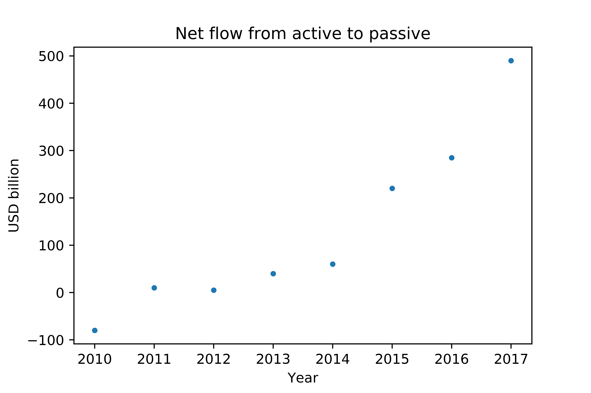
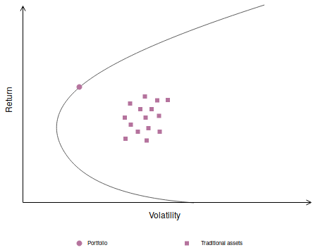
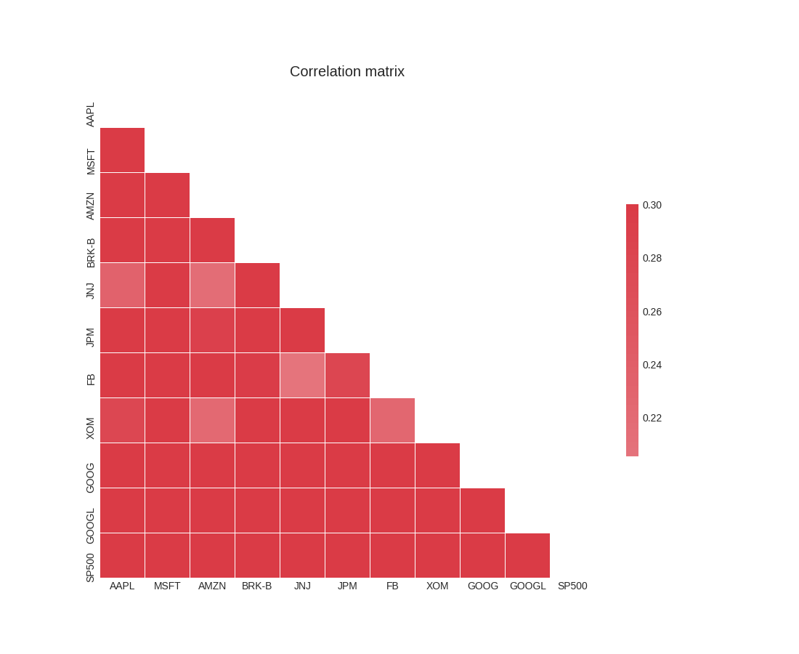
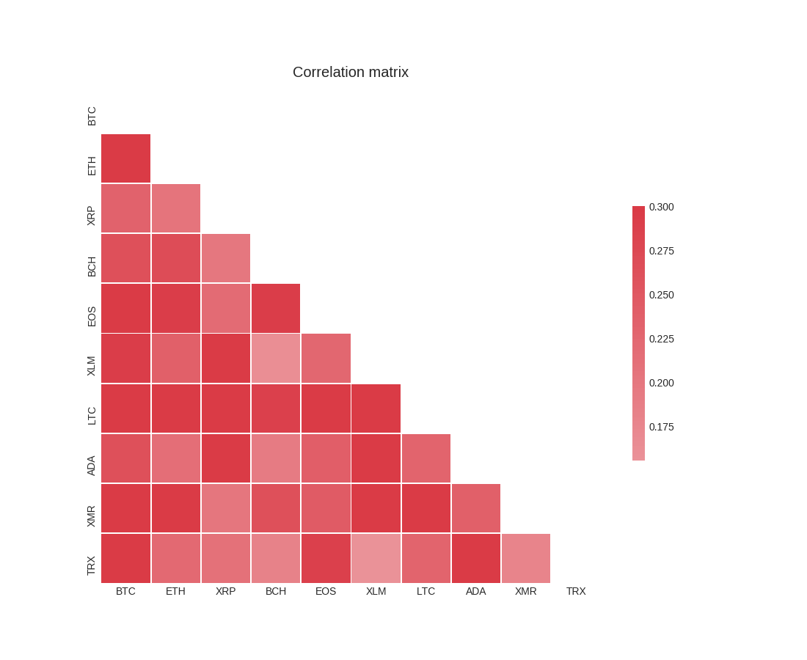

\pagebreak

todo

- in the corr plot make krumelurer saying "Digital assets" och "Traditional assets"
- sudda ut nederdelen av eff frontier, den ska ej vara med.

# Part I: Why indexing

[jl comment]: # (want us to spend very little time on this point. people accept it fast, much faster than crypto.)

In traditional financial markets indexing and passive investing is on the rise. Portfolio theory revolutionzed finance in general and the equity market in particular but has not yet influenced the cryptocurrency market.

## Indexing and traditional finance

A passive investor does not try to beat the market, instead, he invests in vehicles like index funds and ETFs tracking the SP500. An active investor, by contrast, tries to outsmart the market by making active bets such as trying to pick the right stock. These bets make it possible for an active investor to perform better or worse than the market.

The last 20 years a strong trend has emerged within the financial markets -- passive investing is on the rise. In 2017 the net inflow from active funds to passive index funds were USD 500 billion, as shown in @fig:netflow.

{#fig:netflow width=9cm}

There are good reasons for investors to put their money into passive vehicles. Academic studies have shown that trying to beat the market is an unprofitable strategy. For an overview of the literature see for example Fama's paper "Efficient Capital Markets" published in the Journal of Finance, 1969. To understand why passive investing beats active, consider the following sequential logical argumentation, written in the form of three statements:

1. Active managers cannot collectively beat the market.
2. Sub-groups of active investors do not beat their index.
3. Top performers do not stay top performers.

<!-- [sharpe]: https://web.stanford.edu/~wfsharpe/art/active/active.htm -->

The first statement is just plain arithmetic and was proved by Sharpe in his article "The Arithmetic of Active Management" published in the Financial Analysts Journal, 1991. Some active managers must have returns higher the market, and some must have returns lower than the market. As a collective, they will have a return equal to the market. After including fees, however, the all active investors will be beaten by the market due to trading costs.

The second statement is proved by empirical studies. Active managers investing in a certain style (e.g. stocks with high dividend yield or small cap growth stocks) do not beat their sub-index. This makes intuitive sense because almost any style can be replicated with an index, and since indices are less costly than portfolio managers an investor can get the same return for a lower fee.

The last line of defence for active investing is that whilst the two previous statements are true, there exists people who can make the right judgement call and beat the market consistently. Data suggests the opposite. Every year, some investors do indeed beat the market, but these investors are different persons from year to year. By ranking the portfolio managers in one period, and then studying how they performed in subsequent periods, it is evident that the top performers do not stay top performers. <!-- Moreover, a simple graphic from Morningstar suggests the superstar fund managers quickly came down to earth during the years after being named as a top performer.--> This is logical, since risk taking can give extreme returns -- sometimes extremely positive and sometimes extremely negative.

> The performance of active money managers provides the best evidence yet that indexing may be the best strategy for many investors.
>
> / A. Damodaran, Professor of Finance at NYU.

[^fama-efficient]: https://www.jstor.org/stable/2325486  Efficient Capital Markets: A Review of Theory and Empirical Work, Eugene F. Fama, The Journal of Finance

[^sharpe1991]:  journal = " The Financial Analysts' Journal", volume = "47", pages = "7-9", note =  "https://web.stanford.edu/~wfsharpe/art/active/active.htm"

[^damodaran1]: author = "Aswath Damodaran", note = "http://pages.stern.nyu.edu/~adamodar/New_Home_Page/invphillectures/

[^Markowitz-1952]: https://www.jstor.org/stable/2975974?seq=1#pagescan_tab_contents

<!--
He also makes a closing remark on the industry as a whole:
> ... active investing, as structured today, is an awful business, with little to show for all the resources that are poured into it. In fact, given how much value is destroyed in this business, the surprise is not that passive investing has encroached on its territory but that active investing stays standing as a viable business.
-->

## Diversification

Portfolio theory has had a huge impact on finance. Markowitz, who won the 1990 Nobel Memorial Prize in Economic Sciences, invented portfolio theory in 1952 with his famous paper "Portfolio Selection" published in the Journal of Finance.
Portfolio theory changed the lens through which assets are considered. Before Markowitz, investors held a small number of stocks and tended to evaluate their stocks in isolation. Today, almost all investors evaluate their portfolio as a whole before buying or selling assets.

To understand why portfolios are attractive investments, we can utilize an "efficient frontier" in @fig:eff-front-simple. Most standard textbooks on portfolio theory contain a version of this figure, in which we see a collection of assets with their historical volatility on the x-axis and their expected return on the y-axis. Holding one of these assets will give the investor a certain risk (volatility) for a certain reward (return).

{#fig:eff-front-simple width=9cm}

Investors want high returns and low volatility, so the upper left corner is an ideal place to be. When comparing assets against each other there is, of course, a trade-off between risk and reward: taking on more risk (by for example selling some T-bills and investing in a startup) does increase the expected return but also leads to higher volatility.

The efficient frontier is the set of (volatility, return)-points the investor can get if she buys a portfolio of assets, and it is illustrated with a solid black line in @fig:eff-front-simple. Every single point on the efficient frontier is a portfolio the investor can have. The efficient frontier is located close to the ideal upper left corner, reflecting the fact that efficient portfolios are more attractive than owning a single asset. The reason for this is diversification.

{#fig:cor-stocks width=9cm}

Correlation is the driver of diversification. When assets are correlated less than 1.00 with each other, it is possible to increase the risk-adjusted returns by diversifying. The lower the correlations between the assets, the more the efficient frontier will expand to the upper left corner.

In @fig:cor-stocks we see the correlation between 10 important constituents of the SP500: Apple, Microsoft, Amazon, Johnson & Johnson, J.P. Morgan, Facebook, Exxon and Google. Since the correlation between individual equities is below 1.00 they are sutiable to be put into a basket like the SP500.

<!-- we make it practical in the last paragraph -->
Here is an important but subtle point: Even though an asset like gold might have inferior risk-adjusted returns to some stocks, it can be rational for an investor to include gold in his portfolio because doing so improves the portfolio as a whole. Diversification stems from correlation, and if gold has a low correlation with stocks then including it will lead to better risk-adjusted returns for the entire portfolio.

## Indexing and cryptocurrencies

<!--- JL note to self. parallell to internet: competition of standards. -->

Portfolio theory has not influenced the cryptocurrency market yet. As the market matures, Markowitz ideas  There are thousands of cryptocurrencies, and many hundreds are traded on large exchanges. But out of the few people that have bought cryptocurrencies, owning only 1-3 different ones is the norm.

Just like different companies operate in distinct sectors, different cryptocurrencies try to solve different problems -- some focus on building a general purpose scripting language and others on integrating their software with the current banking system.
Just like stocks, cryptocurrencies have a correlation that makes them suitable to be put in a basket. As seen in @fig:cor-t10now, the correlation between cryptocurrencies is even lower than the correlation between equities. In this regard, indexing makes even more sense with cryptocurrencies than it does for the equity market.

{#fig:cor-t10now width=9cm}

[comment]: # "Statistically speaking this section is not different from concluding the correlations are low. however, it is a nice sales argument and makes it super clear for an investor why they want to have a basket."

One way to understand how diversificaiton can work in practice is to consider the "performance reversals" for cryptocurrencies.
For a long period Bitcoin outperformed almost all other cryptocurrencies.
But during the price drop of Bitcoin in January 2018, three of the top 10 digital assets -- EOS, NEO and XLM -- realized positive returns.
Only twice in 12 months has the most profitable cryptocurrency repeated the feat of having the highest in the following month.[^ref-12months]
These performance reversals clearly demonstrate the benefits of diversification. It also provides a good reason to buy a slice of the market, instead of trying to pick a few assets and hope they will perform.

[comment]: # "the text above is needed as background info before the quote below."

[comment]: # "you went into bitcoin in jan 2016, congratulations. when did you buy ripple? or EOS? / novogratz (approximate quote)..  this fictional conversation is a great way to introduce FOMO by mr novogratz and he used it in an interview. this is why indexing makes sense in crypto: the market moves so fast and it is hard to keep up with all news and tech, so it is better to just align yourself with the market in order to not miss out. (however, doing so in practice is hard and that is why our product is needed.)"

<!--
Some early adopters brag about how early they went into Bitcoin and how much profit it has given them. I often tell them "That's a great return, well done! But when did you go buy Ethereum? And at what price point did you buy EOS?". They missed out.

Do not bet on a single cryptocurrency, instead, invest in the market.
i want to tough on the idea they are communities.

An investor who aligns themselves with the market would not have to do the research himself and find information about all the new projects, as well as evaluate them. If enough crypto enthusiasts believe a coin is worth investing in, they will, and when the coin has sufficient trading volume and market cap (i.e. when it is mature enough) it will enter our index so that our investors automatically include it in their porftolio. This way the investor is neither too early nor too late -- being too early increases risk and being too late reduces return.
-->

[slide-comment]: # "I think the slide should be table with coins on y axis, months on x axis, and then just plot a few sample months of the top t coins. So you can see the name is different every month. maybe use t=5 or so."

[^ref-12months]: todo: which 12 months? was it the most recent 12 months? or during 2017?
