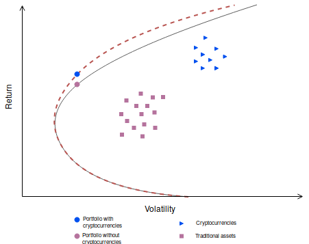
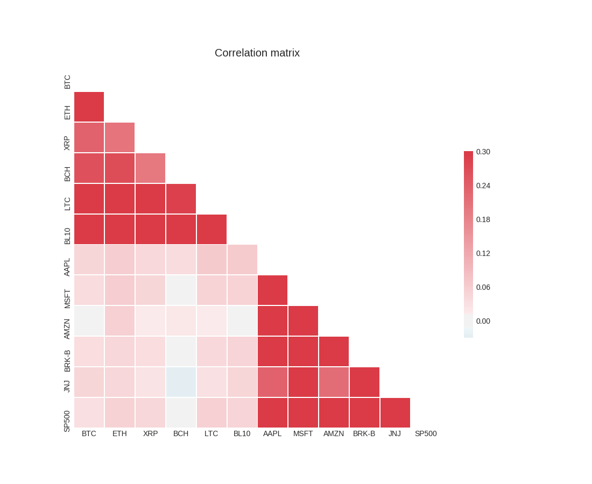

\pagebreak

# Part II: Why cryptocurrencies

If you had to store all your savings in cash and put it under the mattress for 20 years, which currency would you choose? Out of the hundres of currencies available, the most viable options are: U.S. dollars, euros, british punds, schweizer franc, japense yen, and maybe -- depending on where you live -- your own home currency. The limited number of reasonable answers out of the many possible choices reveal an important fact about money: some are better than others.

<!-- The ways in which they are better can differ,
accepted + SoV due to stable economy / central bank.
-->

## Blockchains are useful

> Blockchain computers are new types of computers where the unique capability is trust between users, developers, and the platform itself. This trust emerges from the mathematical and game-theoretic properties of the system, without depending on the trustworthiness of individual network participants.
>
> / Andreessen Horowitz, <https://a16zcrypto.com/>

Firstly, **trading increase our living standards**. The trading of goods predates both writing and money. We know this because money had to be invented for trade, and the first writings ever found were debt ledgers. When humans started trading goods with each other they agreed to do so because both parties were better off after the transaction, thus economic value was created. Both theorical and empirical evidence suggests that trade make us wealthier and increase our living standards substantially.

Secondly, **trust is needed for trade.** If two parties want to transact but do not trust each other, it will be hard to execute the trade. When the trust is too low, it will inhibit the trade.
Larger transaction values require more trust.
For a long distance transaction the seller might worry that the payment will not arrive, at the same time as the buyer is unsure of the item's durability. All forms of uncertanty is the enemy of trust.

Thirdly, **we use trusted third parties today to facilitate trades**. Trust is built slowly over time. To prevent zero knowledge about the counterparty to inhibit a transaction we use trusted third parties like stock brokers and apartment brokers, whom are employed by large corporations with regonizable names and logotypes. Their role is to increase confidence in the transacting parties.
((What these companies consist of is essentially trained people who perform manual checks. These tasks can be automated by computers so that the employee supervise what the computer is doing rather than having to perform the manual work herself.))

Fourthly, **a blockchain digitize trust**. It does so in part because the data cannot be tampered with, [^longest-chain] so that if something is in the blockchain it will stay there. Imagine what this does to uncertanty. The effect is huge. Instead of relying on a trusted third party, the transacting parties can rely on the blockchain. An intriguing question is: how much economic value can be unleashed via trading thanks to the increase in trust and efficiency that blockchain technology can bring?

[^longest-chain]: To get a glimpse of undestanding why a blockchain cannot be tampered with, it is useful to revisit the bitcoin whitepaper: "The network timestamps transactions... forming a record that cannot be changed without redoing the proof-of-work. The longest chain not only serves as proof of the sequence of events witnessed, but proof that it came from the largest pool of CPU power." todo maybe include some more text here, perhaps by leopold or eric w.

<!-- todo maybe write more on this point. it is the one the reader knoew the least about -->

Given that
(1) trading increase our living standards,
(2) trust is needed for trade,
(3) we use trusted third parties today to facilitate trades, and
(4) a blockchain digitize trust,
the invetable conclusion is that blockchains are useful.

## Internet of value or A global network of value transfers

((The internet have disrupted many industries (e.g. media). Cryptocurrencies can disrupt many industries (e.g. finance).))

What the internet did to transfering information, cryptocurrencies might do to transfering value.
This is a bold claim, so let us compare the internet with cryptocurrencies by comparing email with bitcoin.

Sending messages via email (bitcoin) was the first real application of the internet (cryptocurrencies).
If Alice wants to send an email message (bitcoin payment) to Bob, she must know his public address.
For this reason, there were intially only a handful of users and very few emails (payments) sent.
Usage was concentrated to people with a lot of technical skills and interest in computers, as the diffuculty of sending messages (payments) were so high.
The ease of use increase with time, allowing less techincal people to use it too. Surely it is beneficial and intelectually satisfying to understand the inner working of email (bitcoin) but is is not neccessary in order to use it.

For Alice to send an email message (bitcoin payment) to Bob, she must not only know his public address but also her own password (private key). This security feature ensure that only she can send information (value).

To send and recieve emails (payments) it does not matter which country Alice or Bob are in -- the reach is global.    Moreover, it does not matter if they are human -- the technology works if the protocol is followed. Before email (bitcoin) only be humans could send information (value). The fact that computers can do it introduce the possibility for automation.

Before email (bitcoin) there was different networks depending on what type of information you wanted to send (where to send the value). Multiple networks existed, such as fax for documents and telephone for audio (todo include name of banking transfer systems such as SEPA). With the introduction of internet (cryptocurrencies) all these networks were united.

<< ((todo maybe add a fomo section: a lot of vc money was invested in the early days. (include data point). ))

<< to get a table, see the file `comparison.ods`. its current content is pasted below.

|  | Internet | Cryptocurrency |
|-------------------------------------|---------------------------------------------------------------------------------------------|---------------------------------------------------------------------------------------------|
| Use case | Sending information | Sending value |
| First app | Email | Bitcoin |
| Reach | Global | Global |
| Usability in the beginning | Difficult | Difficult |
| Usability after 20 years | Easy | Do not know yet |
| Before | Different networks: Fax, telephone. | Different networks: SEPA, todo  |
| After | One network to send information | One network to send value |
| Easy to understand | No | No |
| Can use w/o understanding it | Yes | Yes |
| VC money invested | A lot | A lot |

Table: Internet and cryptocurrencies share some similiarities.

[comment]: "the main goal of the upcoming sections  is to establish there is nothing magical about fiat. we have had other forms of money. start with a history of money and then describe its properties."

## Definition of money

Money had to be invented for trade. Before there was money, societies relied on gifts and barter -- both of which severly limits trade.
Gifts limits a transaction's value and the counterparties we can trade with, since knowing the person or having a history of successful gift exchanges would be required for valuable trades to take place. Another drawback with gifts are that they rely on humans remembering the quality and amount of the good which was recieved -- a common source of conflicts.
Barter limits the liquidity and frequence of trade, because if paying in-kind is the only option then both the buyer and the seller must be willing to buy and sell each other's goods simoultaneuously. This requires a coincidence of wants, which is unlikely. For example, what should the fisherman do when he has caught more than he is able to eat? Perhaps the fisherman need clothes, but if his village relies on barter then he must find a tailor today -- otherwise the extra fish will be worthless. The tailor may not be hungry. In this case the fisherman might be able to trade the fish for nuts, the nuts for beer, and the beer for clothes. Obviously the coincidence of wants introduces liquidity and accounting problems: will there be a path from fish to clothes via trading, and what are the appropriate exchange ratios for all goods? In an economy with 100 goods there are 4950 prices to keep track of. Another drawback with barter is that it is almost impossible for a musician to pay his rent.

Money solves these problems. All goods can be priced in terms of only one other good so that there are not thousands of exchange rates to keep track of (money is a unit of account). And the musician can recieve money when he plays the piano at a bar (money is a medium of exchange). He can use this money later to pay his rent (money is a store of value). Money can be defined in terms of its functions as a a medium of exchange, store of value and unit of account. Anything that fulfills these properties can be used as money.

A more direct way to define money is to say that it is any item (or verifiable record) that is generally accepted as payment for goods and services as well as repayment of debts.
From this definition, whose keyword is "accepted", it is clear that money works **because** we believe in it. Consequently money works only **if** we believe in it.

<!-- source wikipedia money -->

## Properties of money

Some things are more money than others. This is obvious from the defintion of money because some items (or some verifiable records) function better than others. Seashells cannot be used as money on a beach, and cows are worse than silver coins.
Since money works because (and if) we believe in it, we clearly have some set of properties money should have. For something to function well as money, it should be:

<!-- source http://money.visualcapitalist.com/infographic-the-properties-of-money/ -->

- Scarce, so its value is upheld over time.
- Durable, so it can be used multiple times.
- Portable, so it can be carried around.
- Divisible, so that small payments can be made.
- Fungible and uniform (meaning that all units are interchangeable and have the same purchasing power) because otherwise parts of the money will taken out of circulation.
- Easy to verify but difficult to fake, so that accepting it is easy but fooling others with fake money is difficult.

Intrinsic value is not a property of money, rather, the lack thereof. A paper bill is not worth anything in and of itself. The value comes from the fact that humans agree to accept it as means of payment for valuable goods and services.

## History of money or Evolution of money

Throughout history we have used many forms of money: seashells, knifes, cows, alcohol, and large stones formed in the shape of doughnuts. They fall under the category of commodity money. All commodity money is easy to understand, and most of them function reasonably well as a unit of account. Some commodities are more money than others, thanks to their proporties such as weight, appearance, divisibility, and scarcity. Gold and solver coins was introduced in 600 BC, and later on many societies used coins that had been issued by their king.

Paper money was used in China during the 11th century due to the physical hurdles with commodity money. Gold and silver merchants gave out reciepts which could redeemed for a certain amount of the commodity. This form of money fall under the category of representative money. The reciepts were in essence IOUs because it was the person who held the reciept who had the right to redeem it.
Paper money came to Europe during the 13th century, and by the 18th century gold coins had been replaced by paper money backed by gold. This monetary system is referred to as the gold standard. The paper notes were backed by gold in the sense that they were convertible into a certain amount of gold. Currencies backed by gold are sometimes referred to as hard money because gold is a store of value. <!-- need this sentence to explain goldman ceo quote -->
In the 20th century almost all countries used the gold standard and made these notes legal tender.

After the second world war, most countries pegged their currency to the U.S. dollar. In turn, the dollar was pegged to a certain amount of gold. When Nixon abandoned the gold standard in 1971 USD was no longer backed by anything tangible. Countries responded by de-pegging their currency from the dollar and adopted floating exchange rates.

<!-- source wiki bretton woods -->
<!-- source videon https://www.youtube.com/watch?v=GNo7MDN5-0g
> "After World War II and the Bretton Woods Conference, most countries adopted fiat currencies that were fixed to the U.S. dollar. The U.S. dollar was in turn fixed to gold. In 1971 the U.S. government suspended the convertibility of the U.S. dollar to gold. After this many countries de-pegged their currencies from the U.S. dollar, and most of the world's currencies became unbacked by anything".
-->

<!-- ((today we use commercial bank money. m1 is fiat notes m2 is credit from banks, so banks determine money supply also.)) -->

Today we use paper money and take it for granted all firms price their goods in some fiat currency such as USD or EUR, but this has not always been the case throughout history. We invented money because it solves practical problems, and we have used different forms of money switching from less convinient solutions (e.g. large stonges and cows) to more convinient forms of money (e.g. coins, paper and digits on a screen). If cryptocurrency becomes more convinient than fiat currency, why not switch again?

> If we went into the future and bitcoin was successful, I would be able to explain how it was a natural evolution from hard money.
>
> / Lloyd Blankfein, CEO of Goldman Sachs, in a Bloomberg interview.

<!--
source goldman ceo
https://www.youtube.com/watch?v=YIMWLOSRZ_A
-->

<!-- ((trust govt vs trusting math.))

((
there are good reasons to believe some people will stop using their fiat money and move (in part or in whole) to use cryptocurrencies, because (a) we have changed it before (b) it is more convinient (digital, borderless, instant, etc.) (c) it is a better form of money in the sense that it ticks more boxes (see "proprties" and the fact many fiat currencies are shitty due to inflation arising from printing money ((and high gov spending)).).
))

-->

## Properties of bitcoin

In the section [Properties of money] we listed the following characterics:
Scarce, durable, portable, divisible, fungible, uniform, easy to verify, hard to fake. Bitcoin has all these properties, whereas gold and fiat only posess a few.

|                  | Gold | Fiat | Bitcoin |
|------------------|------|------|---------|
| Scarce           | Yes  | No   | Yes     |
| Durable          | Yes  | Yes  | Yes     |
| Portable         | No   | Yes  | Yes     |
| Divisible        | No   | Yes  | Yes     |

Table: Some types of money are better than others.

Gold is not portable due to its weight, and not divible without special equipment.
Fiat is not scarce because the central bank control the money supply. History is filled with examples of hyperinflation due to hefty increases in the money supply.[^inflation-countries]
Bitcoin is scarce because its money supply is fixed to 21 million BTC, and every BTC is divisble to 100 million pieces. Bitcoin is durable and portable since it is digital.

<< todo i skipped talking about these two. maybe add them maybe not

- Fungible and uniform (meaning that all units are interchangeable and have the same purchasing power) because otherwise parts of the money will taken out of circulation.
- Easy to verify but difficult to fake, so that accepting it is easy but fooling others with fake money is difficult.

[^inflation-countries]: Rome,  Austria,  China,  France, Germany, Greece, Hungary, North Korea, Peru, Poland, Philippines,  British Malaya,  Soviet Union,  Venezuela Yugoslavia and Zimbabwe. Source <https://en.wikipedia.org/wiki/Hyperinflation>

## Different blockchains

[comment]: # "many think bitcoin is the only one. in order to sell our use case -- indexing -- we must spend time to expalin why this is not a winner take it all game. econ of scale, yes, but there are room for many blockchains."

Bitcoin is not the only blockchain, although it is the first famous one. Bitcoin uses a set of technoligies (cryptographic signatures, proof-of-work, blockchain, y, z, etc todo search in vol 2 book, in a chapter about blockchain not bitcoin.) to achieve a specific goal (creating peer-to-peer digital cash). Other blockchain projects uses different sets of technoligies to achieve other goals:

* Ethereum was created with the intention becoming a distributed computing platform.
* The XRP ledger was created to solve the issue with slow and expensive global payments, and their software is written to be integrated with the current financial infrastructure.
* Storj is a peer-to-peer cloud storage application enabling users to rent out their excess disk space, and those users who need extra disk space can purchase cloud storage with cryptocurrency.
* Augur utilize blockchain technology to build a decentralized prediction market protocol, and can be used to to forecast events such as the weather, natural disasters, elections or tax reforms.
* Salt is a lending platform todo write
* Maker todo MKR stablecoin built on ETH  write

All of the projects mentioned above have different use cases and visions for the future.
This attracts a certain set of individuals who find the vision compelling or believe the use case to be of importance.
The people following a project's progress and actively discussing it is often called "the community". Every project's community have some distinct characterics.
Bitcoin's community is convervative, as changes to the protocol is done with causion. Without conensus the protocol remain unchanged. By contrast, many software projects led by companies experience rapid changes as a few selected individuals posess all decision power. Futhermore, the monetary design of bitcoin has roots in Austrian economics, hence people in the bitcoin community have somewhat homogenous views about the world in general and economics in particular.
Ethereum's community consists of many web developers, partly bceause the goal of creating a world computer is attractive to web developers, and partly because Ethereum's scripting language Solidity resembles the popular web programming langauge Javascript.

The vision and current use case can of course shape a project's community, but it goes the other way around too. The community can have an impact on the vision and the technical progress, either directly (by changing the code since most of it is open source) or indirectly (by gaining political power and forming opinion).
It is worth pointing out that cryptocurrencies are evolving -- they are not static because developers are changing the code which affect the current functionality, and advocates might change the opinions of others as well as affect people's vision of the future.

<!-- ### trade-offs and different choices on parameters to optimize -->

We have established that blockchain projects can differ in their visions of the future and their use cases as they try to solve different problems. Can two projects co-exist even though they have they have similar visions and use cases? Yes. They are simply competitors. Among competing blockchain projects there need not emerge a single winner (although network effects exists) since two cryptocurrencies can serve different customer segments.

To understand why there is an equillibrium in which several blockchain projects with the same vision and use cases co-exist, consider that blockchains have a set of parameters. Examples of such parameters are: level of decentralization, transaction cost, consensus algorithm, confirmation time, througput, inflation rate, permissions etc. It is impossible to optimize for all parameters. Trade offs must be made. When functionality is increased, security might suffer. When the level of decentralization is decreased, it might be possible to increase throughput.
For example, both Ethereum and EOS are virtual computers that developers can build games on but they differ in speed and level of decentralization, so depending on what game is built one might be more suitable than the other. Ethereum use proof of stake as their consensus algorithm, whereas EOS use delegated proof of stake. Arguably EOS is less decentralized than Ethereum, but can enjoy a faster network. It was a strategic choice from EOS to do so.
Thus there is an equilibrium where there are several blockchains trying to serve the same customers in different ways.

<< todo it is proof of stake

[comment]: # " To quote multicoin.capital a bet on DPoS is a bet on a few things: 1. There are certain applications that require high throughput and low latency on a neutral database. 2. Not all distributed systems need to be that distributed so as to able to withstand full-frontal government assault."

> Some people have called me a "bitcoin maximalist". I am not a bitcoin maximalist. I am interested in the possibility of open, public, borderless, decentralized, permission-less blockhains, disrupting evrything. In that space, I think there is plenty of room for many different approaches to many different problems.
>
> / A. Antonopoulos The internet of money, vol 2, chapter 10 "The lion and the shark".

<!-- ### winners -->

Even though there are thousands of cryptocurrencies of which hundreds are actively traded on exchanges, most people who have bought cryptocurrency only hold 1-3 different ones. By contrast, an investor rarely hold only 1-3 equities, although they did before Markovitz introduced portfolio theory. As the crypto market matures, people will probably hold a diversified basket of cryptocurrencies. This will be especially true for investors who primarily seek  attractive risk-adjusted returns and does not identify with a particular coin or care to be a part of its community.

Market forces will decide which blockcain projects are important and which are not. Competition will wash out the bad cryptocurrencies and reward projects with a compelling vision, competent team, dedicated community, functioning applications. In the end, the best cryptocurrencies will win.

At Vinter Capital, we do not know who the winners will be. Nor do we do pretend to know. Instead, we have provided a crypto index designed for the passive investor.
((For further details about why indexing makes sense for financial assets in general and cryptocurrencies in particular, as well as evidence that beating the market is an unprofitable strategy, see part I.))
<!-- Although markets are not percetly efficient, they are efficient enough that trying to beat the market by picking stocks or engaging in advanced trading strategies is doomed to fail. For almost all investors it is better to be a passive investor and enjoy the returns of the entire market. -->

## Including cryptocurrency to a traditional portfolio

When considering whether or not to invest in an asset, an investor should study the asset not in isolation but rather as a part of the entire portfolio. It does not make sense to exclude Twitter from an equity portfolio simply because the stock is too risky. Instead, we should compare the portfolio with and without Twitter. After comparing the two portfolios' characterics such as sector allocation and risk-return profiles, then and only then the investor can make a proper judgement of whether to include Twitter or not in his portoflio. This was one of the major ways in which portoflio theory changed finance.

The effects on risk and reward for including the Blockchain10 certificate in a traditional portfolio is illustrated in Table \ref{tbl:trd-bl10-bal}.
In this table, we compare the risk and reward[^fot-portfolios] between investing $100 into three different portoflios.
**TRD** is a traditional portfolio with $60 allocation to stocks and $40 to bonds.
**BL10** is our Blockchain10 certificate that contains the ten largest cryptocurrencies weighted by market capitalization.
**BAL** is a balanced portfolio with $95 invested in TRD and $5 invested in BL10.
By studying the difference between TRD and BAL, it is evident that the historical returns increase substantially but with only a marginal increase in the volatility, thus the sharpe ratio[^other-measures] jump from 0.55 in the traditional portfolio to 1.20 in the balanced portfolio.

|              | TRD  | BL10  | BAL |
|--------------|------|------|-----|
| Return | $3   | $98  | $8  |
| Volatility   | 6%   | 60%  | 7%  |
| Sharpe | 0.55 | 1.63 | 1.20 |

Table: Including cryptocurrencies to a traditional portfolio increase the risk-adjusted returns. \label{tbl:trd-bl10-bal}

[^fot-portfolios]: Annualized measures on daily data from 2015-04 to 2018-04. Sharpe ratio is calculated as the average percentage return divided by volatility.

[^other-measures]: The sharpe ratio is a common measure for risk-adjusted returns, probably the most common one partly due to its simplicity. Other measures are inormation ratio, sortino ratio and value at risk. Numerical results of these calculations can be found in the Appendix, but are omitted here since they point to the same conclusion as the sharpe ratio does.

Let us be crystal clear in our analysis of why adding virtual currencies to a traditional portfolio should make the portfolio more attractive.
Figure \ref{fig:markovitz-2} is an extended version of the  the traditional "efficient frontier graph" from part I. In this figure, cryptocurrencies are marked as blue triangles and traditional financal assets are marked as purple squares. Two efficient frontiers are drawn: the solid purple line represents the set of portoflios investos can have if she only invest in traditional assets, and the dashed blue line represents the set of portoflios an investor can enjoy if she invests in both traditional assets and cryptocurrencies.
Thanks the statistical properties of these assets -- namely their returns, volatility and correlation structure -- the efficient frontier expands to the left when including cryptocurrencies.
((Again, the ideal place to be in the upper left corner, implying that investors who include cryptocurrencies in their portoflio can enojoy higher risk-adjusted returns.))
((The result is a logical result since adding choices always leaves an investor better off.))

For an even deeper explanation/understanding than the efficient frontier graph, consider @fig:eff-front-advanced.
Correlation is the driver of diversification. When the correlation between the assets are lowered, the portfolio's volatility is lowered too.[^volatility-formula] Thanks to the low correlation betwen cryptocurrencies and traditional financial assets (observed in @fig:cor-trad-crypto) there is a diversificaiton effect of adding cryptocurrencies to a portfolio.

[^volatility-formula]: By denoting the weights of all assets in a portoflio with $\vec{w}$ the volatility of that portfolio is $$\sigma = \sqrt{ \vec{w^T} \mathbf{\Sigma} \vec{w} }$$ so when the correlations betweens assets are lowered (implying lower numbers in the $\mathbf{\Sigma}$ matrix) then $\sigma$ is lowered too.

{#fig:eff-front-advanced width=9cm}

{#fig:cor-trad-crypto width=9cm}

<!--
## ((bullish crypto text.))

maybe add a bullish section here. crypto market can go to zero to inf. if it goes well vinter capital will capture a lot of value.

if it should be somewhere it is here as the last section in part ii.

### an emerging asset class.

[comment]: # "the text below is taken from report and nearly summarize all the number crunching done in the previous section. i think it is useful to have a final _punch_ to conclude this section of Why crypto."

> In our view, digital assets represent a new emerging asset class, which by construction is not comparable to any asset class previously in existence. We argue that digital assets are a good example of a decoupling phenomenon, just as in case of emerging markets. Thus, they are good diversifiers of risk exposure to traditional asset classes.

### software eating the world

software is easting the world and cryptocurrencies might disrupt several industries.

https://a16z.com/2011/08/20/why-software-is-eating-the-world/

tl;dr disruption.

### transformative

> ((We believe we're in the early stages of something truly transformative, we believe that several things needs to be built for this to happen and we are set out to build of the infrastructure needed to be part of the disrupting force.))

see also paper we wrote in overleaf:

> We believe that blockchain technology has the potential to transform our world. The application of this technology can result in a more decentralized and transparent economy with far-reaching positive effects such as financial inclusion for everyone.

-->
